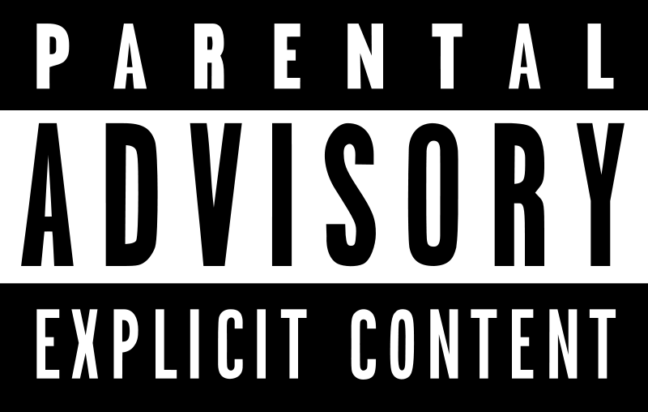

  

 

# Classifying Explicit Song Lyrics
## Project Summary
Many people are familar with the Parent Advisory label (PAL) seen on the cover of many songs and albums. This label serves as a warning to listeners that there is explicit materials is contained in the song(s). The PAL was first introduced to the world in 1985 by the [Recording Industry Association of America](https://www.riaa.com/) (RIAA). According to the RIAA, a the "Parental Advisory is a notice to consumers that recordings identified by this mark may contain strong language or depictions of violence, sex or substance abuse. Parental discretion is advised".

Over the years, the music industry and music listeners have been divided over the PAL. Some claim that the label draws in more sales from teenagers and others argue that the label disrupts a song's artistry. One possible reason for this divide is that the explicitness of a song is subjective. A word or phrase that is explicit to one person may be common language for another. This can cause varations as to which songs get the PAL and which do not. 

One way to combat this is by utilizing NLP. By using NLP, a computer can make more consistent decisions for which songs are grante the PAL. In addditon, the PAL labelling process can happen much faster by a computer than by a human reading the lyrics of a song to determine if there is explicit content.

This project aims to tackle this task by using a dataset of 27k lyrics with their explicit labels.

## Literature
There are a few other previous related works in classifying explicit song lyrics.

## Data

## Project Breakdown

## Results

## Future Work